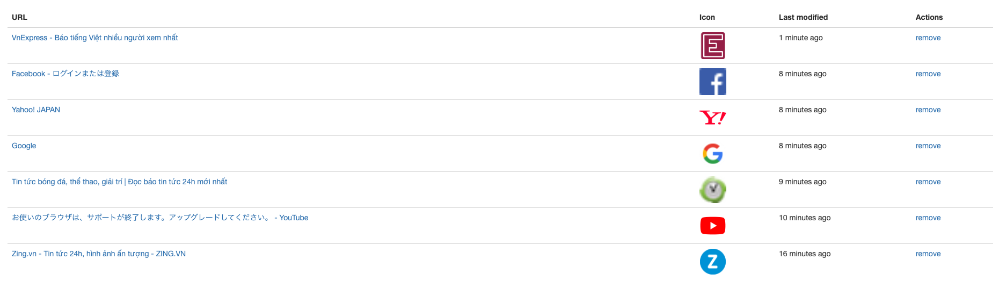

# Bookmark
This tool is used to save favorite link and show the information of favourite webpage. It is inspired by saved.io.

# Building
Requires go1.12+
```
go build
```

# Usage
Run below commands:
```
bookmark -host localhost -port 6969 -secret secret
```

Authenticate yourself onetime by accessing localhost:6969/secret (This way to set cookies which setted before)
The next if you want to bookmark a favourite link you go to:
Ex: localhost:6969/zing.vn

The information of link is saved in bookmark.json

# Screenshot
 
